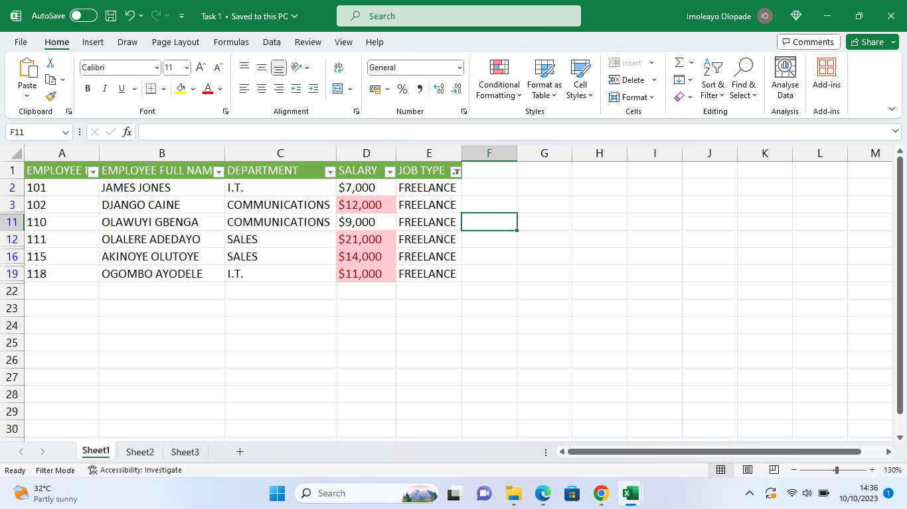
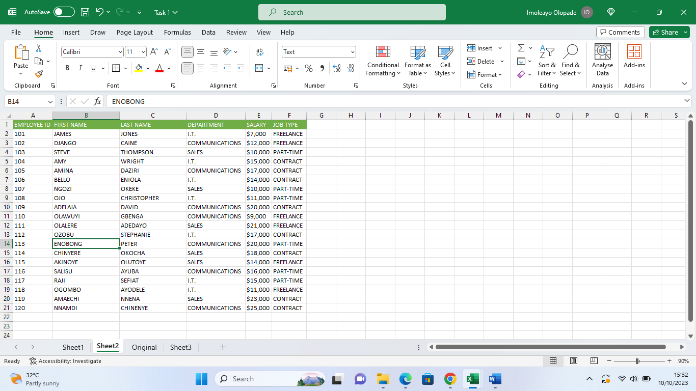
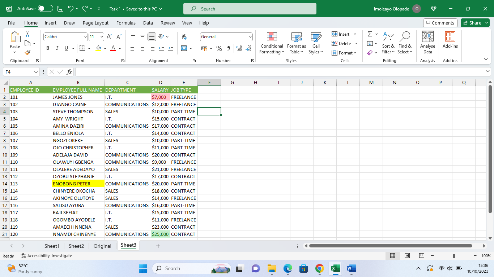

## Imoleayo's Data Analysis Journey With Excel

Introduction
___

This is a Microsoft Excel project that highlights my learning experience including practice and tasks as assigned by my tutor. This project is to test my ability to enter data into a worksheet/workbook and perform some data manipulation.

_The data set in this task was completely made up by me within stipulated guidelines as outlined by my tutor._

This file shows 20 rows of data containing the employee ID, employee full name, department (categorized into communications, sales and I.T), salary between $5000 to $25,000 and the job type which could be part-time, freelance or contract. 
The headings were created in the columns and highlighted with a green background and white text for better differentiation and visibility. 
The original data set i.e., without any manipulation was named "ORIGINAL" worksheet. 
___

The second task was to depict only employees who were freelancers and to highlight those earning above $10,000. This was done by first filtering the data to show only freelancers after which conditional formatting was done to highlight those earning above $10,000 with a red background.
___

The third task was to split the employees full names into first name and last name. This was done by first creating a new column, then selecting the "full name" column. This is followed by using the text to column button on the data ribbon while using space as the delimiter and clicking "finish". After these steps, I changed the names of the columns into first and last names respectively.
___

The final task was to highlight employees whose names begin with the letter 'E' in yellow. 
This was done by first selecting the name column followed by using the 'conditional formatting' button under the Home tab, then selecting 'highlight cell rules', click on 'more rules', format only cells with 'specific text' 'beginning' with 'E', click on format and choose colour yellow and finish up with 'OK'

I was also told to format the salary column such that the highest salary has a green background and the least salary has a red background.
I selected the 'conditional formatting' button under the 'Home' tab, then click on 'top/bottom' rules, select 'top ten items', format cells that rank in top 1 and select green fill with dark green text.

Same applies for the least salary except for clicking on bottom 10 items, format cells that rank in bottom 1 and select red fill with red text.
