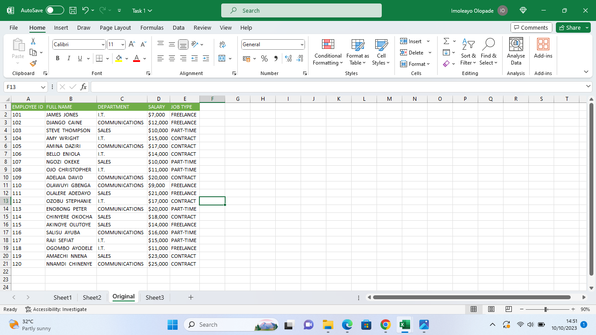

## Imoleayo's Data Analysis Journey With Excel

Introduction
___

This is a Microsoft Excel project that highlights my learning experience including practice and tasks as assigned by my tutor. This project is to test my ability to enter data into a worksheet/workbook and perform some data manipulation.

_The data set in this task was completely made up by me within stipulated guidelines as outlined by my tutor._

___

This file shows 20 rows of data containing the employee ID, employee full name, department (categorized into communications, sales and I.T), salary between $5000 to $25,000 and the job type which could be part-time, freelance or contract. 
The headings were created in the columns and highlighted with a green background and white text for better differentiation and visibility. 
The original data set i.e., without any manipulation was named "ORIGINAL" worksheet. 
